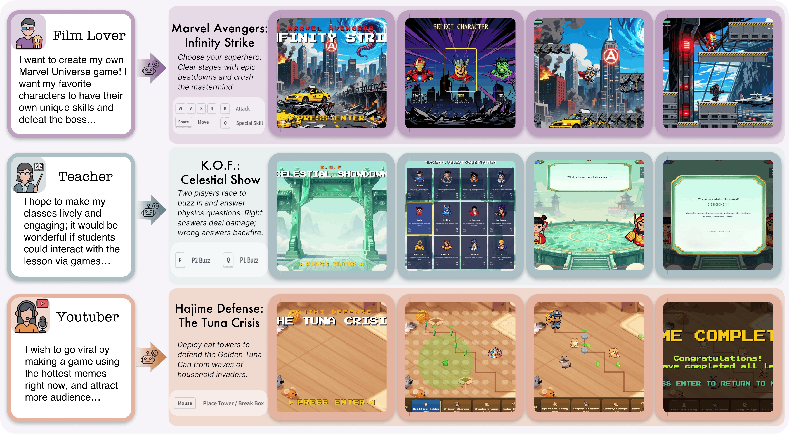

<div align="center">

# OpenGame: Open Agentic Coding for Games

Yilei Jiang, Jinyuan Hu, Qianyin Xiao, Yaozhi Zheng, Ruize Ma, Kaituo Feng,<br>
Jiaming Han, Tianshuo Peng, Kaixuan Fan, Manyuan Zhang, Xiangyu Yue*

*CUHK MMLab*<br>
`yljiang@link.cuhk.edu.hk`, `xyyue@ie.cuhk.edu.hk`<br>
*\*Corresponding author*

<br>

[](https://www.opengame-project-page.com/)
[](#)
[](https://nodejs.org/)

**An open-source agentic framework for end-to-end web game creation from a prompt.**

</div>

<div align="center">
  
</div>


## Abstract

> Game development sits at the intersection of creative design and intricate software engineering, demanding the joint orchestration of game engines, real-time loops, and tightly coupled state across many files. While Large Language Models (LLMs) and code agents now solve isolated programming tasks with ease, they consistently stumble when asked to produce a fully playable game from a high-level design, collapsing under cross-file inconsistencies, broken scene wiring, and logical incoherence. We bridge this gap with **OpenGame**, the first open-source agentic framework explicitly designed for end-to-end web game creation. At its core lies **Game Skill**, a reusable, evolving capability composed of a *Template Skill* that grows a library of project skeletons from experience and a *Debug Skill* that maintains a living protocol of verified fixes—together enabling the agent to scaffold stable architectures and systematically repair integration errors rather than patch isolated syntax bugs. Powering this framework is **GameCoder-27B**, a code LLM specialized for game engine mastery through a three-stage pipeline of continual pre-training, supervised fine-tuning, and execution-grounded reinforcement learning. Since verifying interactive playability is fundamentally harder than checking static code, we further introduce **OpenGame-Bench**, an evaluation pipeline that scores agentic game generation along Build Health, Visual Usability, and Intent Alignment via headless browser execution and VLM judging. Across 150 diverse game prompts, OpenGame establishes a new state-of-the-art. We hope OpenGame pushes code agents beyond discrete software engineering problems and toward building complex, interactive real-world applications. 

## 📢 News

* **[2026-04-21]** 🚀 We have officially released the **OpenGame** framework! You can now access our [Project Page](https://www.opengame-project-page.com/), read the [arXiv Paper](#), and start generating your own web games end-to-end.
## Playable Demos

A curated gallery of web games generated end-to-end by OpenGame from a single prompt. Hover any tile to preview the gameplay; click through for the live build or the full source archive used by the agent.

<table align="center" width="100%">
  <tr>
    <td align="center" valign="top" width="50%">
      <p align="center"><b><font size="4">Marvel Avengers: Infinity Strike</font></b></p>
      <video src="https://github.com/user-attachments/assets/748bc9fa-cf8f-46fc-ba29-731dd18d7cb4"
             poster="assets/posters/marvel.png"
             width="100%" loop muted autoplay playsinline preload="metadata">
      </video>
      <div align="left" style="padding: 0 15px;">
        <p><b>Prompt:</b> <i>"Build an epic side-scrolling action platformer starring the Avengers. I want to select between Iron Man (lasers & flight), Thor (hammer melee & lightning), or Hulk (smash attacks) to fight through 3 distinct levels: a ruined City, a SHIELD Helicarrier, and finally Titan. Each hero needs a basic attack, a special skill, and a screen-clearing Ultimate move. The final boss must be Thanos using Infinity Stone powers. The art style should be hardcore 90s Capcom arcade pixel art, not cute/chibi."</i></p>
        <p><b>Intro:</b> Choose your superhero. Clear stages with epic beatdowns and crush the mastermind.<br/>选择你的超级英雄，清除关卡并击败Boss。</p>
      </div>
      <p align="center">
        <a href="https://www.opengame-project-page.com/#demo"><b>▶&nbsp;&nbsp;Live Demo</b></a>
        &nbsp;&nbsp;·&nbsp;&nbsp;
        <a href="https://github.com/leigest519/OpenGame/raw/demo/assets/downloads/demo_platformer_marvel.zip"><b>↓&nbsp;&nbsp;Source</b></a>
      </p>
      <br/>
    </td>
    <td align="center" valign="top" width="50%">
      <p align="center"><b><font size="4">Harry Potter: Arithmancy Academy</font></b></p>
      <video src="https://github.com/user-attachments/assets/27c623b4-80dc-4549-8123-441e9d7ec075"
             poster="assets/posters/harryPotter.png"
             width="100%" loop muted autoplay playsinline preload="metadata">
      </video>
      <div align="left" style="padding: 0 15px;">
        <p><b>Prompt:</b> <i>"Create a turn-based card battle game set in a pixel art Hogwarts. I want to play as a wizard student dueling a rival in the Dueling Club. The twist is that magic requires knowledge: to cast spell cards like 'Expelliarmus' or 'Stupefy', I must answer trivia questions (Math/Science) correctly. Include a 'Magic Resonance' combo system where getting consecutive right answers boosts my spell damage. The style should be atmospheric Gothic fantasy pixel art with parchment-style UI and magical particle effects."</i></p>
        <p><b>Intro:</b> Cast spell cards by answering trivia correctly. Chain combos for bonus damage.<br/>正确答题释放魔法卡牌，连续答对触发魔力共振连击。</p>
      </div>
      <p align="center">
        <a href="https://www.opengame-project-page.com/#demo"><b>▶&nbsp;&nbsp;Live Demo</b></a>
        &nbsp;&nbsp;·&nbsp;&nbsp;
        <a href="https://github.com/leigest519/OpenGame/raw/demo/assets/downloads/demo_uiHeavy_harryPotter.zip"><b>↓&nbsp;&nbsp;Source</b></a>
      </p>
      <br/>
    </td>
  </tr>
  <tr>
    <td align="center" valign="top" width="50%">
      <p align="center"><b><font size="4">K.O.F: Celestial Showdown</font></b></p>
      <video src="https://github.com/user-attachments/assets/4b36b3e7-d5da-4a73-96f3-5f6828cd4ecc"
             poster="assets/posters/kombat.png"
             width="100%" loop muted autoplay playsinline preload="metadata">
      </video>
      <div align="left" style="padding: 0 15px;">
        <p><b>Prompt:</b> <i>"Make a local 2-player quiz fighting game that looks and feels like a classic 90s SNK retro arcade fighter (like The King of Fighters). Instead of punching, players fight by racing to hit a 'Buzzer Key' to answer physics questions. If you answer fast and correctly, you deal damage; if you're wrong, you take self-damage. The setting is a grand fighting tournament stage located in a majestic 'Heavenly Court' (Chinese celestial realm), complete with ancient jade gates, floating auspicious clouds, and golden traditional motifs. Include dramatic health bars, screen shake on hits, and a 'K.O.' sequence. Visuals should be highly detailed 16-bit pixel art, typical of 90s arcade cabinets."</i></p>
        <p><b>Intro:</b> Two players race to buzz in and answer physics questions. Right answers deal damage; wrong answers backfire.<br/>双人抢答物理题，答对造成伤害，答错反噬自身。</p>
      </div>
      <p align="center">
        <a href="https://www.opengame-project-page.com/#demo"><b>▶&nbsp;&nbsp;Live Demo</b></a>
        &nbsp;&nbsp;·&nbsp;&nbsp;
        <a href="https://github.com/leigest519/OpenGame/raw/demo/assets/downloads/demo_uiHeavy_kombat.zip"><b>↓&nbsp;&nbsp;Source</b></a>
      </p>
      <br/>
    </td>
    <td align="center" valign="top" width="50%">
      <p align="center"><b><font size="4">Hajimi Defense: The Tuna Crisis</font></b></p>
      <video src="https://github.com/user-attachments/assets/39776d1e-7168-4ff0-ad86-be4f71d52dec"
             poster="assets/posters/hajimi.png"
             width="100%" loop muted autoplay playsinline preload="metadata">
      </video>
      <div align="left" style="padding: 0 15px;">
        <p><b>Prompt:</b> <i>"Make a hilarious tower defense game called 'Hajimi Defense' where cute cats defend a 'Golden Tuna Can' from an invasion of household pests (Cucumbers and Vacuums). The towers should be funny cat memes: a spitting Tabby, a sniper Siamese, and a fat orange cat that throws buns for AOE damage. Include a mechanic where players can click to break obstacles (like boxes) to free up building space. The art style should be hand-drawn, pastel, and super cute (Kawaii)."</i></p>
        <p><b>Intro:</b> Deploy cat towers to defend the Golden Tuna Can from waves of household invaders.<br/>部署猫猫炮塔，保卫金枪鱼罐头抵御入侵者。</p>
      </div>
      <p align="center">
        <a href="https://www.opengame-project-page.com/#demo"><b>▶&nbsp;&nbsp;Live Demo</b></a>
        &nbsp;&nbsp;·&nbsp;&nbsp;
        <a href="https://github.com/leigest519/OpenGame/raw/demo/assets/downloads/demo_towerDefense_hajimi.zip"><b>↓&nbsp;&nbsp;Source</b></a>
      </p>
      <br/>
    </td>
  </tr>
  <tr>
    <td align="center" valign="top" width="50%">
      <p align="center"><b><font size="4">StarWars: Mandalorian Protocol</font></b></p>
      <video src="https://github.com/user-attachments/assets/750bbdfd-718c-49e7-8563-11e147f5cb94"
             poster="assets/posters/starWars.png"
             width="100%" loop muted autoplay playsinline preload="metadata">
      </video>
      <div align="left" style="padding: 0 15px;">
        <p><b>Prompt:</b> <i>"Create a high-intensity top-down action RPG shooter set in the Star Wars universe. Play as The Mandalorian fighting through an Imperial Base to rescue Grogu. The gameplay should be a Twin-Stick Shooter style where I can use a Blaster (ranged), a Beskar Spear (melee), and a Jetpack Dash to dodge. Include Stormtrooper enemies and a tactical depth system where characters can walk behind crates and walls. The visuals should be metallic sci-fi pixel art."</i></p>
        <p><b>Intro:</b> Fight through the Imperial Base as the Mandalorian. Shoot, slash, and dash to rescue Grogu.<br/>扮演曼达洛人突入帝国基地，射击、喷射闪避，营救古古。</p>
      </div>
      <p align="center">
        <a href="https://www.opengame-project-page.com/#demo"><b>▶&nbsp;&nbsp;Live Demo</b></a>
        &nbsp;&nbsp;·&nbsp;&nbsp;
        <a href="https://github.com/leigest519/OpenGame/raw/demo/assets/downloads/demo_topDown_starWars.zip"><b>↓&nbsp;&nbsp;Source</b></a>
      </p>
      <br/>
    </td>
    <td align="center" valign="top" width="50%">
      <p align="center"><b><font size="4">Squid Game: Red Light, Green Light</font></b></p>
      <video src="https://github.com/user-attachments/assets/2dc20fa2-7737-4d28-b5ce-2c4efafe5ffe"
             poster="assets/posters/squidGame.png"
             width="100%" loop muted autoplay playsinline preload="metadata">
      </video>
      <div align="left" style="padding: 0 15px;">
        <p><b>Prompt:</b> <i>"Recreate the intense 'Red Light, Green Light' scene from Squid Game as a survival reflex game. The player controls a character in a green tracksuit running across a sandy field towards a finish line. There is a Giant Robot Doll on the right; when she sings, we run; when she turns her head, we must stop instantly or get shot. Crucial visual detail: Dead bodies and blood pools should NOT disappear, they must pile up on the field to create a chaotic atmosphere. Use a gritty, realistic 16-bit pixel art style."</i></p>
        <p><b>Intro:</b> Run when she sings, freeze when she turns. One wrong move and you're eliminated.<br/>她唱歌时跑，她转头时定住。一步走错，当场淘汰。</p>
      </div>
      <p align="center">
        <a href="https://www.opengame-project-page.com/#demo"><b>▶&nbsp;&nbsp;Live Demo</b></a>
        &nbsp;&nbsp;·&nbsp;&nbsp;
        <a href="https://github.com/leigest519/OpenGame/raw/demo/assets/downloads/demo_topDown_squidGame.zip"><b>↓&nbsp;&nbsp;Source</b></a>
      </p>
      <br/>
    </td>
  </tr>
</table>

**To run a demo locally:**

```bash
unzip demo_*.zip && cd demo_*
npm install
npm run dev   # opens at http://localhost:5173
```

## Installation

#### Prerequisites

```bash
# Node.js 20+
curl -qL https://www.npmjs.com/install.sh | sh
```

#### From source (recommended while we prepare the npm release)

```bash
git clone https://github.com/leigest519/OpenGame.git
cd OpenGame
npm install
npm run build
npm link
```

This exposes the `opengame` command on your `PATH`.

## Quick Start

OpenGame is currently driven from the command line in **headless mode** —
you give it a one-shot prompt and it builds the game end-to-end.

```bash
# Create an empty folder for your new game
cd agent-test
mkdir -p games/my-game && cd games/my-game

# Generate the game from a single prompt
opengame -p "Build a Snake clone with WASD controls and a dark theme." --yolo
```

When the agent finishes, open the generated `index.html` (or run the printed
dev-server command) in your browser to play your game.

> If you prefer to create games anywhere on disk, set absolute paths instead:
>
> ```bash
> export GAME_TEMPLATES_DIR="/absolute/path/to/OpenGame/agent-test/templates"
> export GAME_DOCS_DIR="/absolute/path/to/OpenGame/agent-test/docs"
> ```
>
> Headless runs auto-elevate the approval mode to `auto-edit` so the agent
> can write/edit files. Shell commands stay disabled by default — pass
> `--yolo` (or `--approval-mode yolo`) if you want the agent to also run
> shell commands. See
> [`docs/users/features/headless.md`](docs/users/features/headless.md) for
> the full headless reference.

#### Authentication

OpenGame's agent runtime supports an OpenAI-compatible API. Set the following environment variables:

```bash
export OPENAI_API_KEY="your-api-key-here"
export OPENAI_BASE_URL="https://api.openai.com/v1"     # optional
export OPENAI_MODEL="gpt-4o"                            # optional, swap in GameCoder-27B when running it locally
```

#### Asset / GDD provider keys (image, video, audio, reasoning)

Beyond the main agent LLM, OpenGame's asset-generation tools talk to image,
video, and audio providers. You bring your own keys for each — OpenGame ships
with no defaults. Each modality is configured **independently**, so you can
mix providers (e.g. DashScope for image, Doubao for video, OpenAI for
reasoning):

```bash
export OPENGAME_IMAGE_PROVIDER=tongyi         # tongyi | doubao | openai-compat
export OPENGAME_IMAGE_API_KEY=sk-...
# ...and similarly for OPENGAME_REASONING_*, OPENGAME_VIDEO_*, OPENGAME_AUDIO_*
```

A complete env-var reference, settings.json schema, and examples for OpenAI /
fal.ai / OpenRouter / DashScope / Doubao live in
[`docs/users/configuration/api-keys.md`](docs/users/configuration/api-keys.md).
A copy-paste template is at [`.env.example`](.env.example).

OpenGame prints a one-line provider-status banner at startup so you can
confirm which modalities are wired up before the run begins.

## Game Skill

OpenGame's agent is bootstrapped with **Game Skill**, a reusable capability split into two parts:

- **Template Skill** — picks an appropriate engine/template (canvas, Phaser, three.js, etc.) and scaffolds a stable, conventional project structure so later edits stay coherent.
- **Debug Skill** — runs the game in a sandbox, catches integration errors, console errors, and broken interactions, and systematically resolves them until the game is playable end-to-end.

Together they let the agent move from "writes plausible code" to "ships a working game."

## Configuration

OpenGame can be configured via `settings.json`, environment variables, and CLI flags.

- **User settings**: `~/.qwen/settings.json`
- **Project settings**: `.qwen/settings.json`

> The on-disk settings directory is currently still named `.qwen` for backward compatibility with the upstream agent runtime. We plan to migrate this to `.opengame` in a future release.

## GameCoder-27B

`GameCoder-27B` is a Code LLM purpose-built for OpenGame. It is trained with:

1. **Supervised Fine-Tuning (SFT)** on curated game-development trajectories covering engine APIs, project scaffolding, and bug-fix workflows.
2. **Reinforcement Learning** with reward signals derived from real game playability (using OpenGame-Bench-style verifiers).

## OpenGame-Bench

`OpenGame-Bench` is a benchmark for evaluating agents that build interactive web games. Unlike static code-evaluation benchmarks, it dynamically launches generated games, drives them with scripted interactions, and verifies playability criteria (rendering, controls, game-loop progression, win/loss states, etc.).

The evaluation pipeline will be released soon.

## Acknowledgments

OpenGame builds on the excellent open-source work of:

- **[qwen-code](https://github.com/QwenLM/qwen-code)** — the agent runtime and CLI scaffolding that OpenGame extends with Game Skill, GameCoder-27B integration, and OpenGame-Bench tooling.
- **[Google Gemini CLI](https://github.com/google-gemini/gemini-cli)** — the original CLI architecture that qwen-code is itself based on.

We thank both teams for making their work openly available.
